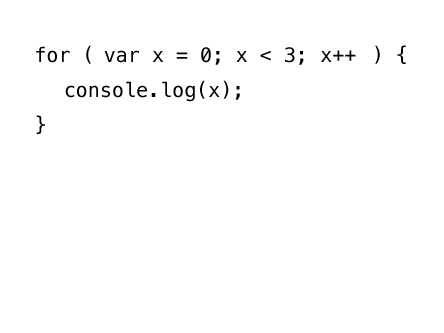

# Geometric Pattern

Short link to this workshop: https://workshops.hackclub.com/geometric_pattern

[Demo](TODO)

---

We'll be creating a cool graphic like the one above, using JavaScript and p5.js.
[p5.js](http://p5js.org/) is a library for making stuff in conjunction with the [HTML canvas element](https://developer.mozilla.org/en-US/docs/Web/HTML/Element/canvas). p5.js is nothing more than JavaScript code written to make commonly-desired functionality much more accessible. It is primarily used to make visuals and graphics. A great introduction can be found [here](http://taeyoonchoi.com/signing-coders-1/).

**Table of Contents:**

- [Part I: Set-up](#part-i-set-up)
- [Part II: Priming the Files](#part-ii-priming-the-files)
- [Part III: Drawing on the Canvas](#part-iii-drawing-on-the-canvas)
- [Part IV: Adding Color](#part-iv-adding-color)
- [Part V: Publishing and Sharing](#part-v-publishing-and-sharing)
- [Part VI: Animate It](#part-vi-animate-it)
- [Part VII: Hacking](#part-vii-hacking)

## Part I: Set-up

First, go to Cloud9 and open up your `projects` workspace by pressing Open.


Once in the workspace, right-click the `projects` folder on the left and select `New Folder`. Name it `geometric_pattern`.

Next, right-click the `geometric_pattern` folder, select `New File`, and name it `index.html`.
Then, right-click the `geometric_pattern` folder again, select `New File` again, and this time, name it `main.js`.

## Part II: Priming the Files

### Priming the HTML File

Double-click `index.html` to open it. Just as we've done previously, we'll type this base structure into our HTML file:

```html
<!DOCTYPE html>
<html>
  <head>
  </head>
  <body>
  </body>
</html>
```

Now, let's add our JavaScript dependencies, namely, p5.js. Let's add that into our **body** with a `<script>` tag: **Please type everything except the URL, which you can copy and paste!**

```html
<body>
  <script src="https://cdnjs.cloudflare.com/ajax/libs/p5.js/0.4.12/p5.js"></script>
</body>
```

We'll also need to attach our JavaScript file, `main.js`. Add this below the line that adds p5.js:

```html
<body>
  <script src="https://cdnjs.cloudflare.com/ajax/libs/p5.js/0.4.12/p5.js"></script>
  <script src="main.js"></script>
</body>
```

Now we'll save (with shortcut: `CTRL+s` / `Command+s`) and open Live Preview (`Preview` > `Live Preview`).

### Priming the JS File

Double-click `main.js` to open, and type the following:

```js
function setup() {
}

function draw() {
}
```

p5.js works by automatically calling two special functions: [`setup`](http://p5js.org/reference/#/p5/setup) and [`draw`](http://p5js.org/reference/#p5/draw) to create the visuals on your webpage. We'll be writing our own code in these functions, so that p5.js can then run our code.

`setup` is run only once, at the beginning. `draw` on the other hand, is run repeatedly after `setup` finishes, and in this way, provides the basis for any animation or interaction you see in your project.

Let's save and refresh Live Preview.

It looks like nothing, because our functions do nothing. Let's add something for `setup` to set up.

```js
function setup() {
  createCanvas(400, 600);
}
```

[`createCanvas`](http://p5js.org/reference/#p5/createCanvas) is a function that takes two arguments (two numbers for width and height, respectively) and creates an [HTML canvas element](https://developer.mozilla.org/en-US/docs/Web/HTML/Element/canvas) (i.e., where your pattern will be contained) of that size.

In this project, we'll be creating a grid of rectangles. As a preliminary step, we can first create a row of rectangles.

First, let's decide how many rectangles we want in the row. We can store this number in a variable **at the top, above both functions**:

```js
var NUM_RECTANGLES = 10;

function setup() {
  createCanvas(400, 600);
}

function draw() {
}
```

We'll use this to determine the width of the rectangles we want to draw, by doing some simple math. Let's declare a variable to store the value of the rectangle width; name it `rectangleWidth`. Add the declaration at the top of the file, underneath `NUM_RECTANGLES`, and define it within `setup`:

```js
var NUM_RECTANGLES = 10;
var rectangleWidth;

function setup() {
  createCanvas(400, 600);
  rectangleWidth = width/NUM_RECTANGLES;
}

function draw() {
}
```

p5.js stores the width of the canvas in a variable named [`width`](http://p5js.org/reference/#/p5/width). By dividing the canvas width by the number of rectangles, we can calculate the rectangle width, which we'll store in `rectangleWidth`.

## Part III: Drawing on the Canvas

### Drawing a Rectangle

p5.js makes drawing rectangles easy with the function [`rect`](http://p5js.org/reference/#p5/rect).

Let's see the `rect` function in action by drawing a rectangle at the top-left corner of the canvas.

```js
function draw() {
  rect(0, 0, rectangleWidth, height);
}
```

Save and refresh Live Preview.

In this example, the first two arguments we pass to the `rect` function are the x and y coordinates of the top-left corner of the rectangle. We've passed in 0 and 0, respectively, which means the top-left corner of the rectangle will also be the top-left corner of the canvas. The p5.js coordinate system is a bit different from the traditional cartesian plane you may be used to. The latter two arguments are the width and height of the rectangle. We've created one rectangle with the width of `rectangleWidth` and the height of `height` (the canvas height).

You can play around with these values to get a better feel of how this function works.

### Drawing a Row of Rectangles


Let's try to draw a row of rectangles first. We'll split the canvas into `NUM_RECTANGLES` rectangles, which means we'll want to draw a rectangle every `rectangleWidth`. Modify your `draw` function so it looks like this. Notice how we have to change the first argument (the x-coordinate) in each line.

```js
function draw() {
  rect(0, 0, rectangleWidth, height);
  rect(rectangleWidth, 0, rectangleWidth, height);
  rect(2*rectangleWidth, 0, rectangleWidth, height);
  rect(3*rectangleWidth, 0, rectangleWidth, height);
  rect(4*rectangleWidth, 0, rectangleWidth, height);
}
```


We haven't filled up the canvas with rectangles yet. We could keep going, since we've allotted room for `NUM_RECTANGLES` rectangles. Or, we could use a construct in programming called a loop!

A loop can be used to repeat a set of instructions as many times as you decide. We'll be using a type of loop called a **for-loop**:



Let's remove all those repetitive lines and add a loop into our `draw` function. Our `draw` function should now look like this:

```js
function draw() {
  for (var x = 0; x < width; x = x + rectangleWidth) {

  }
}
```

You'll notice there are multiple parts to this:

- `var x = 0;`: this is a variable that will store the value of our x-coordinate as we draw ellipses across the row.
- `x < width`: this is the condition of the for-loop, and it means that the instructions within the loop should be executed as long as `x` is less than `width`.
- `{` and the corresponding `}` at the bottom: these braces enclose the code that should be repeated.
- `x = x + rectangleWidth;`: this is one instruction we want to be repeated. This will alter the value of `x`, incrementing it by `rectangleWidth` every time we go through the loop.

If we save and refresh, we'll see nothing. That's because we there is no code inside the for-loop that affects the canvas. Let's add a line to draw a rectangle:

```js
function draw() {
  for (var x = 0; x < width; x = x + rectangleWidth) {
    rect(x, 0, rectangleWidth, height);
  }
}
```

We're supplying `x` as the x-coordinate (cleverly named, eh?), and 0 as the y-coordinate, of the rectangle's top-left corner.

If you save and refresh, you'll see the canvas split up into rectangles of dimension `rectangleWidth` and `height`. (`height`, as you may have guessed, is the counterpart to `width`, and it is where p5.js stores the height of the canvas.) Since the value of `x` is increased by `rectangleWidth` after every iteration of the for-loop, rectangles are drawn in intervals of `rectangleWidth` pixels, just like how you changed the x-coordinate argument in `rect` when you were manually creating each rectangle. This is the magic of the for-loop.

**Remark: if your page is frozen, refresh the page and check your for-loop code. Chances are you've got an [infinite loop](https://en.wikipedia.org/wiki/Infinite_loop).**

### Introducing Mouse Interaction

Let's make the grid of rectangles change color when we hover the mouse over it. In this example, I'll make the rectangles closest to the mouse a bright red, with the rectangles around it fading out in color.

p5.js has a `fill` function that will fill the shapes you draw with a specific color and opacity. We can use this to set the color and opaacity of each rectangle as we draw it on the canvas.

Since the `draw` function TODO

### Drawing a Grid of Rectangles

So that's great, we've created one row of rectangles. But what we'd like is a grid of rectangles (or squares, if you will.)

Just like we used a loop to repeat rectangles in the horizontal direction, we can also use another loop to repeat them in the vertical direction.

If we wrap our existing for-loop in another for-loop, we'll be performing the action of filling an entire row with circles, multiple times. And thus covering multiple rows.

Let's put everything so far inside another for-loop. Don't forget to update `rect` with the proper y-coordinate and rectangle height arguments:

```js
function draw() {
  for (var y = 0; y < height; y = y + rectangleWidth) {
    for (var x = 0; x < width; x = x + rectangleWidth) {
      rect(x, y, rectangleWidth, rectangleWidth);
    }
  }
}
```

As with the previous for-loop's `x`, we're executing the code inside the `{` and `}` as long as the value of `y`, which we've initialized at `0`, is less than `height`. We're also incrementing `y` at the end of each iteration by `rectangleWidth`.

Using this incrementing `y` variable as our y-coordinate is how we're able to draw rows up and down the canvas.

Save and refresh Live Preview to check it out!


### Changing Fill

One way to use `color` is to provide 3 arguments; each corresponding to [red (R), green (G), and blue (B) values](https://en.wikipedia.org/wiki/RGB_color_model).

Let's choose our color to be red. The R, G, and B values for a bright red are 255, 0, and 0, respectively. We can create this color with `color(255, 0, 0)`.

Now we'll pass this color to the `fill` function. If we do this before drawing the ellipse, all the ellipses we draw will be filled with that color. Let's give this a try and type the following line immediately before calling the `ellipse` function in `draw`:

```js
fill(color(255, 0, 0));
```

Save and refresh. Your canvas should now look like red dragon scales.

### Changing Stroke

Just like how there's a `fill` for changing the fill color, there's a `stroke` for changing the stroke color. Right now, the stroke is black (hence the black outlines).

We can make a garish display by adding a bright green stroke, if we place the following line beneath our `fill` function call:

```js
stroke(color(0, 255, 0));
```

Save and refresh, and let your eyes be assaulted by this faux pas.

### Changing Color between Rows

While this looks pretty cool, let's make the rows different colors. We can get the gradient effect by setting a starting color, and incrementing the R, G, and B values each time we go through the for loop.

Let's do this by first declaring variables to store each of the R, G, and B values at the top of the file:

```js
var NUM_RECTANGLES = 10;
var rectangleWidth;
var circleRadius;
var rVal;
var gVal;
var bVal;
```

Next, we'll set their initial values at the top of the `draw` function:

```js
function draw() {
  rVal = 255;
  gVal = 0;
  bVal = 0;

  var isShifted = false;

...

}
```

And then increment the values at the bottom of the `y` for-loop in `draw`, by adding these lines.

```js
...

    rVal = rVal - 2;
    gVal = gVal + 7;
    bVal = bVal + 3;
  }
}
```

Here, we're decrementing the R value by 2, incrementing the G value by 7, and the B value by 3.

You can also try adding those three lines within the x for-loop, which will modify the colors within each row.

Finally, we'll replace the arguments in `color` with these variables, in both the `fill` and `stroke` function calls:

```js
fill(color(rVal,gVal,bVal));
stroke(color(rVal,gVal,bVal));
```

Now, save and see the gradient effect you've applied throughout the pattern! Yay!

## Part V: Publishing and Sharing

### Downloading Your Masterpiece

You can actually download the this cool pattern to your computer, to use as a desktop background or what have you. p5.js provides a function [`saveCanvas`](https://p5js.org/reference/#p5/saveCanvas) to download the canvas.

We can attach this function to a key press by using p5's `keyPressed` function. Add this at the bottom of your `main.js`:

```js
function keyPressed() {
  if (keyCode === 115 || keyCode === 83) {
    saveCanvas('geometricPattern', 'png');
  }
  return false;
}
```

This code says that if the user presses a key with the `keyCode` 115 or 83 (which both correspond to "s"), `saveCanvas` should be called and the file should be saved as `geometricPattern.png`.

The `return false;` at the end of the function tells the browser to ignore any default behavior that might be associated with the pressed key (ex. if you press enter, the browser thinks that you're trying to submit a form by default -- this prevents that).

### Making It Live

Make sure all of your files are saved. Then, head on over to the terminal in Cloud9 by pressing `alt+t` and type the following commands (pressing Enter after each one):

- `git add --all`
- `git commit -m "Create a geometric pattern using p5.js"`
- `git push`

Then, enter your GitHub username and password (careful here, as password will not be displayed).

Congratulations! Your pattern is now live on `USERNAME.github.io/geometric_pattern/` (replace `USERNAME` with your own GitHub username!)

## Part VI: Animate It

_**WARNING: THIS SECTION INVOLVES FLASHING COLORS AND IS NOT RECOMMENDED FOR THOSE WITH A HISTORY OF EPILEPSY.**_

_Even if you have not been previously diagnosed with epilepsy, you should be careful, and immediately close the window and consult a doctor if you experience any of the following symptoms: lightheadedness, altered vision, eye or face twitching, jerking or shaking of arms or legs, disorientation, confusion, or momentary loss of awareness._

---

Let's first add the line to change the `draw` function from running 60 times a second to 5 times a second. We can do this by using the `frameRate` function in `setup`:

```js
function setup() {
  createCanvas(400, 600);

  frameRate(5);

  rectangleWidth = width/NUM_RECTANGLES;
  circleRadius = rectangleWidth/2;
}
```

That said, we can create a cool scrolling color effect by manipulating our colors to cycle. Right now we are resetting our initial RGB values each time `draw` runs. But if we didn't reset every time, we could have rotating colors.

```js
function setup() {
  createCanvas(400, 600);

  frameRate(5);

  rectangleWidth = width/NUM_RECTANGLES;
  circleRadius = rectangleWidth/2;

  rVal = 255;
  gVal = 0;
  bVal = 0;
}

function draw() {
  var isShifted = false;

...
```

If we move the three lines that set the initial RGB values to `setup`, then we will be increment the values indefinitely. If we save and refresh our Live Preview, we'll see that everything is white. What's the deal?

Since the max values of RGB are 255, 255, 255 (which makes white), any values above that will be white. The `draw` function executes so many times per second that you can't see the color change progression.

We can have color progression while keeping the values below 255 by [modding](https://en.wikipedia.org/wiki/Modulo_operation) each of these by 256. "Modding a by b" means that we divide a by b, and take the remainder. For example, 5mod2 gives us 1, because 5 divided by 2 has a remainder of 1. This arithmetic operation is available to us in JavaScript with the modulo (`%`) operator.

Let's change our incrementation code to incorporate this:

```js
rVal = (rVal - 2) % 256;
gVal = (gVal + 7) % 256;
bVal = (bVal + 3) % 256;
```

JavaScript `%` operator does something stupid, in that it mods negative numbers incorrectly. We can get around this by recognizing that subtracting 2 and modding is the same as adding 254 and modding.

```js
rVal = (rVal + 254) % 256;
```

Save and refresh and be warned that it might be jarring.

As a check, your `main.js` should look like this:

Final code:

```js
var NUM_RECTANGLES = 10;

var rectangleWidth;
var circleRadius;

var rVal;
var gVal;
var bVal;

function setup() {
  createCanvas(400, 600);

  frameRate(5);

  rectangleWidth = width/NUM_RECTANGLES;
  circleRadius = rectangleWidth/2;

  rVal = 255;
  gVal = 0;
  bVal = 0;
}

function draw() {
  var isShifted = false;

  var y = height;
  while (y >= 0) {

    var x;

    if (isShifted) {
      x = circleRadius;
    } else {
      x = 0;
    }

    while (x <= width) {
      stroke(color(rVal, gVal, bVal));
      fill(color(rVal, gVal, bVal));
      ellipse(x, y, rectangleWidth, rectangleWidth);
      x = x + rectangleWidth;
    }

    y = y - circleRadius;
    isShifted = !isShifted;

    rVal = (rVal + 254) % 256;
    gVal = (gVal + 7) % 256;
    bVal = (bVal + 3) % 256;
  }
}
```


## Part VII: Hacking

Ideas:

- try different colors until you find a combination you like (you can do this by changing the start values of `rVal`, `gVal`, and `bVal`. You can also change the incrementing value)
- try no fill to make cool line art with overlapping circles
  > 
- change number of circles per line
- change number of lines / spacing of lines
- change shape of ellipses (what about horizontally fat ovals? vertically tall ovals?)
- change placement or spacing of ellipses
  > 
- change shapes (p5.js offers easy functions to make triangles, rectangles, and more)
- p5.js knows where your mouse [x](https://p5js.org/reference/#/p5/mouseX) and [y](https://p5js.org/reference/#/p5/mouseY) coordinates are. You could have the seizure-inducing colors only on mouse over.


**Examples:**

- [Orpheus Remix](http://prophetorpheus.github.io/geometric_pattern/version2.html)
- [Sophie's Internet Party](https://sohuang.github.io/geometric_pattern.1/)
